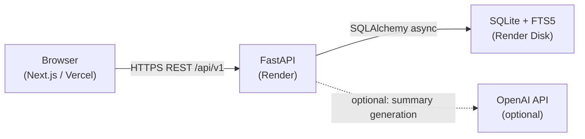
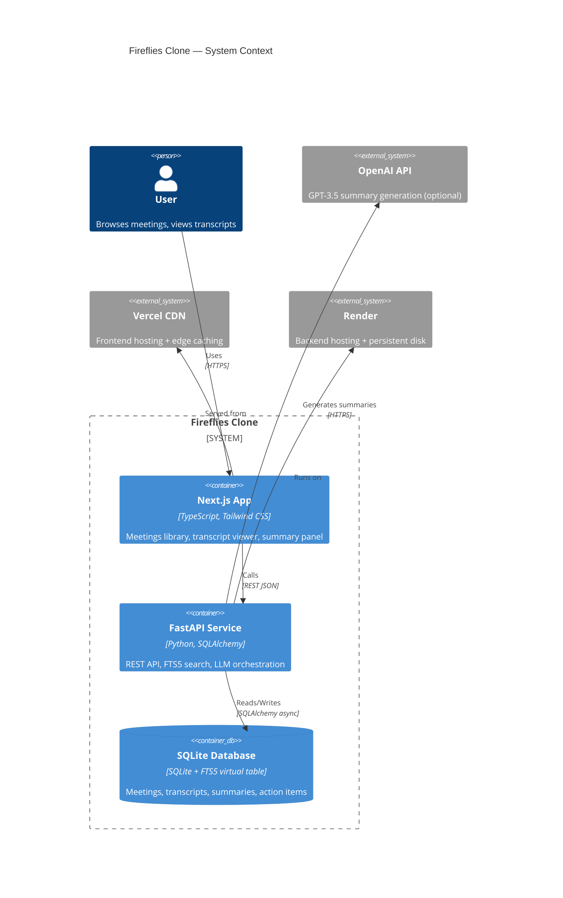
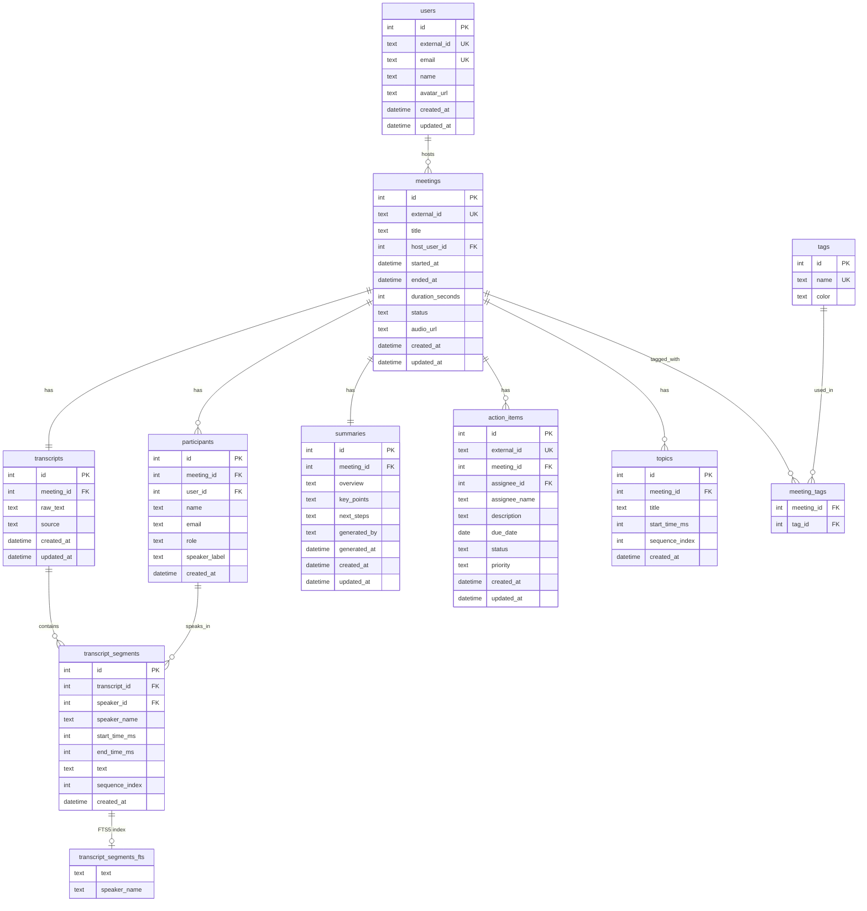

# Fireflies Clone — Meeting Notes & Transcription Platform

A full-stack clone of the [Fireflies.ai](https://fireflies.ai) meeting-assistant web application, built as a Scaler SDE Fullstack assignment.

---

## Live Demo

| Service | URL |
|---------|-----|
| **Frontend (Vercel)** | _Add your Vercel URL here after deployment_ |
| **Backend API (Render)** | _Add your Render URL here after deployment_ |
| **API Docs (Swagger)** | `{backend-url}/docs` |

> **Note:** The Render free tier spins down after 15 minutes of inactivity. The first request after inactivity may take ~30 seconds. Please wait — the app will load.

---

## Features

| Feature | Status |
|---------|--------|
| Meetings library with search, filter, sort, pagination | ✅ |
| Meeting detail — transcript with speaker labels & timestamps | ✅ |
| Mock media player with seek bar and speed controls | ✅ |
| Bidirectional player ↔ transcript synchronization | ✅ |
| In-transcript FTS5 search with highlighted results & prev/next navigation | ✅ |
| AI-generated meeting summaries (OpenAI or seeded fallback) | ✅ |
| Action items CRUD — create, edit, complete, delete | ✅ |
| Key topics / chapters with player seek | ✅ |
| Create / edit / delete meetings with transcript upload | ✅ |
| Loading skeleton states | ✅ |
| Toast notifications | ✅ |
| Responsive layout | ✅ |
| 5 seeded meetings with realistic multi-speaker transcripts | ✅ |

---

## Tech Stack

| Layer | Technology |
|-------|-----------|
| Frontend | Next.js 14 (App Router), TypeScript (strict), Tailwind CSS |
| State management | TanStack Query v4 (server state) + Zustand (client state) |
| Backend | Python 3.12, FastAPI 0.111 |
| Database | SQLite with FTS5 full-text search |
| ORM / migrations | SQLAlchemy 2.x (async), Alembic |
| Testing | pytest + pytest-asyncio |
| Deployment | Vercel (frontend), Render (backend) |

---

## Architecture Overview

The application follows a standard three-tier architecture: a statically-optimized Next.js frontend served from Vercel, communicating over HTTPS with a FastAPI backend on Render, which reads/writes a persistent SQLite database stored on a Render disk.

The backend enforces a strict layered architecture: **Route handlers → Service layer → Repository layer → Database**. No business logic lives in route handlers; no SQL lives in services.



### Request Flow

```
Browser
  └─ Axios (NEXT_PUBLIC_API_URL)
       └─ FastAPI route handler
            └─ Service layer (business logic)
                 └─ Repository layer (SQL / FTS5 queries)
                      └─ SQLite (async via aiosqlite)
```

---

## System Architecture Diagram



---

## Database Schema



**Key design decisions:**

- `transcript_segments` stores each utterance as a row (not a TEXT blob) — enables player sync, FTS5, and per-segment operations
- `transcript_segments_fts` is an FTS5 external-content virtual table with Porter stemming — `MATCH 'budget'` returns stems like "budgeting"
- `external_id` (UUID) on `meetings` and `action_items` prevents ID enumeration in public URLs
- All child tables use `ON DELETE CASCADE` — deleting a meeting removes all its data atomically
- `action_items.status` CHECK constraint enforces valid values at the database level, not just the application level

---

## Folder Structure

```
fireflies-clone/
├── frontend/                  # Next.js 14 application
│   ├── src/
│   │   ├── app/               # App Router pages
│   │   │   ├── (dashboard)/   # Dashboard layout (sidebar + topbar)
│   │   │   │   ├── meetings/  # /meetings — library page
│   │   │   │   └── meetings/[id]/  # /meetings/[id] — detail page
│   │   ├── components/
│   │   │   ├── layout/        # Sidebar, Topbar, PageContainer
│   │   │   ├── meetings/      # MeetingCard, MeetingList, modals
│   │   │   ├── transcript/    # TranscriptPanel, TranscriptSegment, search
│   │   │   ├── player/        # MediaPlayer with bidirectional sync
│   │   │   ├── summary/       # SummaryPanel, ActionItemList, TopicList
│   │   │   └── ui/            # Button, Badge, Toast, Skeleton, etc.
│   │   ├── hooks/             # useMeetings, useMeeting, useTranscript, etc.
│   │   ├── lib/
│   │   │   ├── api/           # Axios client + typed API functions
│   │   │   └── utils/         # time.ts, speakerColors.ts, constants.ts
│   │   ├── stores/            # Zustand: playerStore, uiStore
│   │   └── types/             # TypeScript interfaces
│   ├── public/
│   │   └── sample-audio.wav   # Shared audio file for all meetings
│   └── vercel.json
│
├── backend/                   # FastAPI application
│   ├── app/
│   │   ├── api/v1/endpoints/  # meetings, transcripts, summaries, action_items, topics, search
│   │   ├── core/              # config, exceptions, logging
│   │   ├── db/                # session, base, init_db
│   │   ├── models/            # SQLAlchemy ORM models (9 tables)
│   │   ├── schemas/           # Pydantic v2 DTOs
│   │   ├── repositories/      # Data access layer
│   │   ├── services/          # Business logic layer
│   │   └── utils/             # transcript_parser, llm_client, time_utils
│   ├── alembic/               # Database migrations
│   │   └── versions/0001_initial_schema.py
│   ├── seeds/                 # Seed script + 5 VTT transcript files
│   ├── tests/                 # pytest test suite (27 tests)
│   ├── .env.example
│   ├── render.yaml
│   └── requirements.txt
│
└── docs/                      # Architecture specification documents
```

---

## API Endpoints

| Method | Path | Description |
|--------|------|-------------|
| `GET` | `/api/v1/health` | Health check — `{"status":"ok","db":"connected"}` |
| `GET` | `/api/v1/meetings` | List meetings — supports `q`, `date_from`, `date_to`, `participant`, `sort`, `page`, `page_size` |
| `POST` | `/api/v1/meetings` | Create meeting |
| `GET` | `/api/v1/meetings/{id}` | Get meeting detail |
| `PATCH` | `/api/v1/meetings/{id}` | Update meeting metadata |
| `DELETE` | `/api/v1/meetings/{id}` | Delete meeting (cascades to all children) |
| `GET` | `/api/v1/meetings/{id}/participants` | List participants |
| `GET` | `/api/v1/meetings/{id}/transcript` | Get transcript with all segments |
| `POST` | `/api/v1/meetings/{id}/transcript` | Upload/paste transcript |
| `GET` | `/api/v1/meetings/{id}/transcript/search` | FTS5 search — returns segments with `<mark>` highlights |
| `GET` | `/api/v1/meetings/{id}/summary` | Get AI summary |
| `POST` | `/api/v1/meetings/{id}/summary/generate` | Trigger LLM summary generation |
| `GET` | `/api/v1/meetings/{id}/action-items` | List action items |
| `POST` | `/api/v1/meetings/{id}/action-items` | Create action item |
| `PATCH` | `/api/v1/meetings/{id}/action-items/{item_id}` | Update action item (status, description, etc.) |
| `DELETE` | `/api/v1/meetings/{id}/action-items/{item_id}` | Delete action item |
| `GET` | `/api/v1/meetings/{id}/topics` | List topics / chapters |
| `GET` | `/api/v1/search` | Global search across all meetings |

All `{id}` path parameters are `external_id` (UUID) — never the internal integer primary key.

All error responses follow: `{"detail": "...", "code": "NOT_FOUND" | "CONFLICT" | "PARSE_ERROR" | "INTERNAL_ERROR"}`

---

## Transcript Synchronization Design

The bidirectional player ↔ transcript sync is the most complex interactive feature.

### Forward sync (player → transcript)

The HTML `<audio>` element fires `timeupdate` ~4 times per second. On each event:
1. `currentTime` is converted to milliseconds
2. A **binary search** over the sorted `segments` array finds the segment where `start_time_ms ≤ currentMs < end_time_ms` — O(log n) vs O(n) linear scan
3. `activeSegmentId` is updated in the Zustand `playerStore`
4. `TranscriptSegment` components subscribe to `activeSegmentId` via a Zustand selector — only the segments that enter or leave the active state re-render (not the entire list)
5. The active segment's `ref` calls `scrollIntoView({ behavior: 'smooth', block: 'center' })`

### Reverse sync (transcript → player)

Clicking any transcript segment timestamp calls `seekTo(start_time_ms)` from the Zustand store, which sets `audio.currentTime = ms / 1000`. The forward sync immediately resolves the new active segment on the next `timeupdate`.

### Why Zustand instead of React Context

The `timeupdate` event fires at 4 Hz. React Context re-renders every consumer on every state change. With 20+ transcript segments subscribed, that's 80+ component re-renders per second. Zustand's selector-based subscriptions mean only the `TranscriptSegment` that changes active state re-renders — typically 2 re-renders per event (the segment turning on, the segment turning off).

---

## Search Architecture (FTS5)

### Transcript search (in-meeting)

```sql
SELECT ts.id, ts.speaker_name, ts.start_time_ms, ts.end_time_ms, ts.sequence_index,
       snippet(transcript_segments_fts, 0, '<mark>', '</mark>', '...', 20) AS highlighted_text
FROM transcript_segments_fts
JOIN transcript_segments ts ON ts.id = transcript_segments_fts.rowid
JOIN transcripts t ON t.id = ts.transcript_id
WHERE transcript_segments_fts MATCH :query
  AND t.meeting_id = :meeting_id
ORDER BY rank
LIMIT 50;
```

- FTS5 `snippet()` function injects `<mark>` tags around matching terms
- `tokenize='porter ascii'` means searching "latency" also matches "latencies" and "latent"
- Porter stemming is orders of magnitude more useful than `LIKE '%query%'` which requires exact substring matches

### FTS5 index synchronization

Three SQLite triggers keep the FTS5 virtual table in sync with `transcript_segments`:

```sql
-- INSERT: standard FTS insert
AFTER INSERT → INSERT INTO fts(rowid, text, speaker_name) VALUES (new.id, ...)

-- UPDATE: external content table requires delete-then-insert
AFTER UPDATE → INSERT INTO fts(fts, rowid, ...) VALUES ('delete', old.id, ...)
               INSERT INTO fts(rowid, ...) VALUES (new.id, ...)

-- DELETE: external content table requires the special 'delete' command row  
AFTER DELETE → INSERT INTO fts(fts, rowid, ...) VALUES ('delete', old.id, ...)
```

The `DELETE` trigger uses the external content table pattern — a regular `DELETE FROM fts` does not reliably purge entries for `content=` tables in all SQLite builds.

### Dashboard search (across meetings)

Dashboard search uses `LIKE` on short title strings and participant names — FTS5 would be over-engineered for this low-cardinality use case. Date filters use indexed `started_at` comparisons.

---

## Setup Instructions

### Prerequisites

- Python 3.11+ with pip
- Node.js 18+ with npm

### Backend

```bash
cd backend

# 1. Copy environment variables
cp .env.example .env
# Edit .env if needed (defaults work for local dev)

# 2. Install dependencies
pip install -r requirements.txt

# 3. Run database migrations
alembic upgrade head

# 4. Seed with sample data
python -m seeds.seed_data

# 5. Start the API server
uvicorn app.main:app --reload --port 8000
```

Backend available at: `http://localhost:8000`
API docs: `http://localhost:8000/docs`

### Frontend

```bash
cd frontend

# 1. Copy environment variables
cp .env.local.example .env.local
# .env.local already points to http://localhost:8000 — no edit needed

# 2. Install dependencies
npm install

# 3. Start the development server
npm run dev
```

Frontend available at: `http://localhost:3000`

---

## Testing

```bash
cd backend
python -m pytest tests/ -v
```

**Test coverage:**
- `test_meetings.py` — meeting CRUD, pagination, filtering
- `test_transcripts.py` — transcript upload, segment retrieval
- `test_action_items.py` — action item CRUD, status transitions
- `test_search.py` — FTS5 round-trip: insert segment → index populated → MATCH query returns it

All tests use an in-memory SQLite database with the FTS5 virtual table and triggers replicated, so they are isolated and fast (~3 seconds for 27 tests).

---

## Deployment

### Step-by-step deploy order

The CORS circular dependency requires a specific order:

**1 — Deploy Backend to Render (with FRONTEND_URL=* temporarily)**

1. Push code to GitHub
2. Create a new Render Web Service pointing to `backend/`
3. Set these environment variables in the Render dashboard:
   - `DATABASE_URL` = `sqlite+aiosqlite:////var/data/fireflies.db`
   - `FRONTEND_URL` = `*` ← temporary, allows all origins while Vercel deploys
   - `SECRET_KEY` = any random string
   - `OPENAI_API_KEY` = _(optional)_
4. Add a Render Disk: mount path `/var/data`, size 1 GB — this prevents data loss on restart
5. Render will run build command: `pip install -r requirements.txt && alembic upgrade head && python -m seeds.seed_data`
6. Start command: `uvicorn app.main:app --host 0.0.0.0 --port $PORT`
7. Note your Render URL: `https://fireflies-backend-xxxx.onrender.com`

**2 — Deploy Frontend to Vercel**

1. Import repository in Vercel, set root directory to `frontend/`
2. Set environment variable:
   - `NEXT_PUBLIC_API_URL` = `https://fireflies-backend-xxxx.onrender.com`
3. Deploy. Note your Vercel URL: `https://fireflies-clone-xxxx.vercel.app`

**3 — Update Render CORS**

1. Go back to Render dashboard
2. Change `FRONTEND_URL` from `*` to `https://fireflies-clone-xxxx.vercel.app`
3. Trigger a Render redeploy
4. Test: open browser console on the Vercel URL and verify no CORS errors

---

## Environment Variables

### Backend (`backend/.env`)

| Variable | Required | Description | Default |
|----------|----------|-------------|---------|
| `DATABASE_URL` | Yes | SQLAlchemy async connection string | `sqlite+aiosqlite:///./fireflies.db` |
| `FRONTEND_URL` | Yes | Allowed CORS origin | `http://localhost:3000` |
| `SECRET_KEY` | Yes | App secret (not currently used for JWT, reserved) | `change-me-in-production` |
| `OPENAI_API_KEY` | No | OpenAI API key for LLM summaries. App works without it — uses seeded summaries | _(empty)_ |
| `LLM_MODEL` | No | OpenAI model name for summary generation | `gpt-3.5-turbo-0125` |

**Production (Render) overrides:**
- `DATABASE_URL` → `sqlite+aiosqlite:////var/data/fireflies.db` (persistent disk path)
- `FRONTEND_URL` → your Vercel URL

### Frontend (`frontend/.env.local`)

| Variable | Required | Description | Default |
|----------|----------|-------------|---------|
| `NEXT_PUBLIC_API_URL` | Yes | Backend API base URL (baked into Next.js build) | `http://localhost:8000` |

**Production (Vercel) overrides:**
- `NEXT_PUBLIC_API_URL` → your Render URL (must be set before build)

---

## Tradeoffs

**SQLite over PostgreSQL**
The assignment specifies SQLite. For a single-user demo with SQLite's WAL mode and a persistent Render disk, this is reliable. The trade-off is no horizontal scaling — acceptable for this use case.

**FTS5 content= table over full-document FTS5**
An external content table means the FTS index stores only rowids, not full text copies. This halves the disk footprint but requires triggers to stay in sync. The triggers use the external-content delete/update pattern (not a simple `DELETE`) — which is correct per SQLite docs but easy to implement incorrectly (a common pitfall that was deliberately avoided here).

**Zustand over TanStack Query for player state**
TanStack Query manages server state only. The player's `currentTimeMs`, `isPlaying`, and `activeSegmentId` are pure client state that changes 4× per second. Storing them in TanStack Query would trigger unnecessary server-state invalidation logic on every tick. Zustand's store with selector-based subscriptions is the correct tool.

**Seeded summaries with optional LLM fallthrough**
The application degrades gracefully if no `OPENAI_API_KEY` is set — it returns the seeded summary and the frontend shows an info toast. This means the demo is fully functional without any API key.

**`external_id` (UUID) on all public-facing resources**
Auto-increment integer IDs in URLs are enumerable — anyone can iterate `meetings/1`, `meetings/2`, etc. UUIDs make enumeration infeasible. This is applied to `meetings` and `action_items`. The `external_id` column is always the value exposed in API responses and URL paths.

---

## Future Improvements

- **Real-time transcription**: Integrate a speech-to-text API (Whisper, Assembly AI) to transcribe uploaded audio files
- **Authentication**: JWT-based auth with email/password; the schema already has a `users` table
- **PostgreSQL migration**: The repository layer is database-agnostic; swapping the `DATABASE_URL` to Postgres would require only minor dialect adjustments and Alembic migration changes
- **WebSocket support**: Real-time updates when a meeting's transcript is still being processed
- **Shareable meeting links**: Role-based access — invite collaborators by email to view/comment
- **Export**: Transcript and summary export to Markdown, PDF, or DOCX
- **Global search**: FTS5 UNION query across all meetings already specified — UI is scaffolded at `/search`
- **Comments/soundbites**: Per-segment annotation, already supported by the data model (`segment_id` FK on action items)

---

## Assumptions

1. **No real authentication** — A single default user (`Alex Rivera`) is assumed to be logged in. The `users` table and `host_user_id` FK are present and functional; auth middleware is out of scope.
2. **No real audio transcription** — Transcripts are seeded from `.vtt` files. The media player uses a single shared `.wav` file for all meetings.
3. **Audio player is a UI demo** — All meetings use the same `sample-audio.wav`. The transcript timestamps are mapped to that file's duration. Clicking a timestamp seeks the player; playback highlights the active segment.
4. **LLM summary is optional** — The app is fully usable without an OpenAI API key. Seeded summaries are pre-populated. The "Generate AI Summary" button works when `OPENAI_API_KEY` is set and gracefully falls back otherwise.
5. **SQLite is sufficient** — This is a demo with seeded data. For a production system with concurrent writes, PostgreSQL would be appropriate.

---

## Seed Data

Five meetings are seeded covering different team scenarios, date-distributed so all filter states are testable:

| Meeting | Date | Participants | Duration |
|---------|------|-------------|----------|
| Q3 Product Roadmap Review | Yesterday (this week) | 4 | 10 min |
| Product Roadmap Planning | 3 days ago (this week) | 3 | 9 min |
| Engineering Weekly Standup | Last week | 4 | 8.5 min |
| Investor Pitch Prep — Series B | 3 weeks ago | 3 | 8.7 min |
| Design System Sprint Review | 6 weeks ago | 3 | 9.3 min |

Each meeting has:
- 15–30 transcript segments with realistic multi-speaker dialogue
- Summary with overview, key points, and next steps
- 3 action items (1 `completed`, 1 `in_progress`, 1 `pending`)
- 3–5 topics / chapters with `start_time_ms` for player seek
